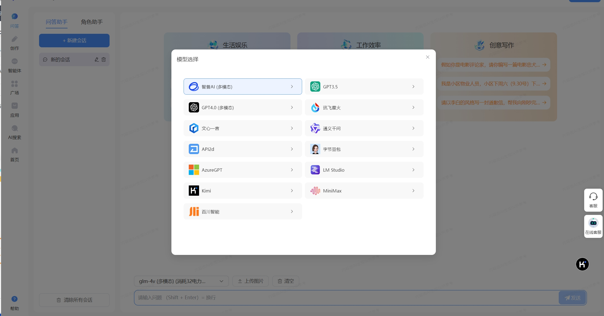
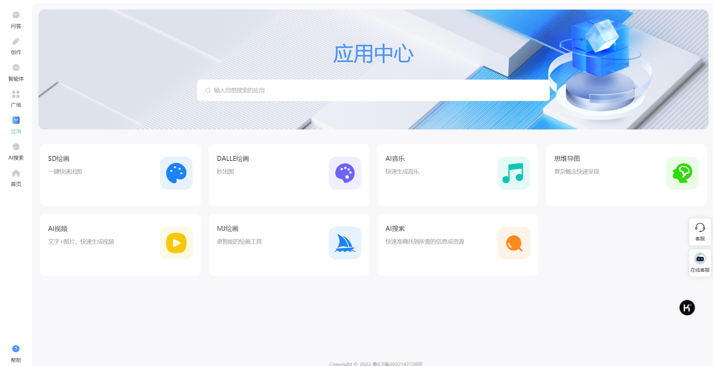
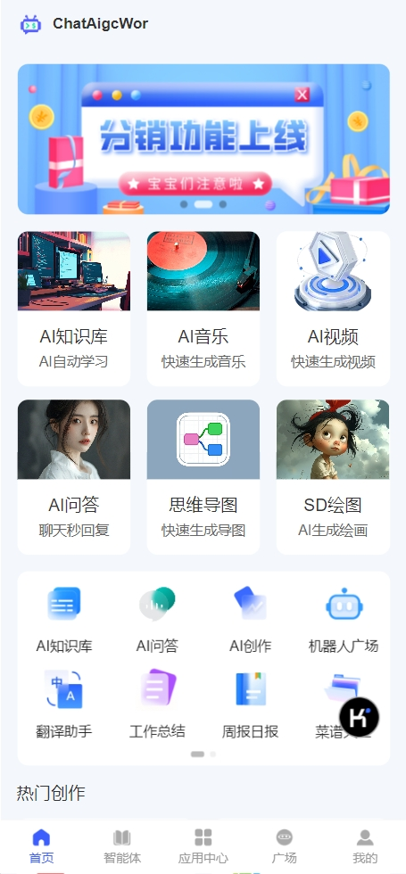

<h1 align="center">🚀work企业级全能AI知识库系统「PHP源码版」</h1>
<h4 align="center">🚀快速开发、🛠️ 一键生成代码、✅后台多端自适应、📱手机端、🖥️PC（电脑）端前台</h4> 

       

##  👀体验后台
### 管理后台
**地址：
账号：admin 密码：123456**
### 微信小程序前台

### 手机端网页前台
https://www.cnai.art/mobile
### PC（电脑）端网页前台
https://www.cnai.art/

### 开发文档
地址：https://doc.cnai.art/

#### 🔥🔥系统为商业授权后才可使用
<h4 align="center">🚀快速开发、🛠️ 一键生成代码、✅后台多端自适应、📱手机端、🖥️PC（电脑）端前台</h4> 

## 👨‍💻‍简介
全能AI知识库系统PHP版，基于前后端分离架构以及Vue3、uni-app、ThinkPHP6.x、PostgreSQL、pgvector技术栈开发，包含PC端、H5端。ChatMoney支持问答式和文档式知识库，能够导入txt、doc、docx、pdf、md等多种格式文档。导入数据完成向量化训练后，用户提问即可进行向量化搜索，并且结合大语言模型进行AI回答，可以提升AI回答的专业性和实用性。知识库应用支持对外发布聊天网页窗口，iframe代码，js代码以及API接口，拥有强大的第三方对接能力。适用于企业智能客服、企业智能文档、专家顾问助理等多种企业级商用场景，具有较大的商业使用价值。欢迎前往体验~
 

### 🧰场景介绍

🚀 **AIGC知识库**: 赋能AI创业, 为个人增效, 为企业降本!

🌟 **产品定位介绍**:
定位于企业级AI服务市场, 提供高度定制化个性化的AI机器人解决方案。ChatAIGC致力于打造成为国内领先的, 可私有化部署, 可二次开发的「超级AI平台」, 赋能AI创业, 为个人增效, 为企业降本。AI时代「超级个体」概念不再遥远, 一人创办一家百万美金收入公司不再是梦想!

🏢 **企业级AIGC知识库**:
- 🚀 0代码0门槛, 按照需求灵活构建机器人
- 👥 业务人员: 零代码无门槛, 直接上手使用
- 🔧 部署简单: 可视化引导, 傻瓜式安装
- 🛠️ 二次开发: 可去除版权, 易扩展开发
- 🔋 售后支持: 1对1售后指导, 运营部署文档

💡 **AIGC知识库系统**可以进行机器人角色设定、知识库训练、发布/分享机器人, 同时还带有AI智能对话, 无限场景AI创作等强大功能, 支持ChatGPT、ChatGLM、文心一言、讯飞星火及本地大模型, 并且拥有多种第三方渠道对接能力。适用于AI教培, 个人学习, 个人创作, 个人文档整理, 企业智能客服、企业智能文档、专家顾问助理等多种个人及企业商业场景, 有较大的商业推广价值!

✨ **产品功能亮点**:
- 🧠 智能时代的知识引擎
  - 🎶 AI音乐: 音乐创作随心所欲
  - 🎨 AI绘画: 智能创意绘梦无限
  - 🔧 AI管理后台: 智能管理一键掌控
  - 🤖 AI问答创作: 您的随身智能助手
  - 🤖 AI机器人: 海量机器人轻松定制

🖥️ **PC端 & H5端**

🔐 **知识库权限转让**:
- 可以邀请同事、合伙人一起录入资料, 共同训练机器人

🔗 **知识库共享**:
- 支持多种向量模型, GPT、Gemini、Azure、文心一言、讯飞星火、智谱清言等大语言模型, 多种文件处理模型

🎯 **提供全面的知识管理功能**, 包括先进的向量模型支持、便捷的知识库共享、多样化的文件处理模型以及灵活的权限管理机制, 帮助用户高效管理信息和数据。

👥 **公司或组织内部人员出现变更时**, 支持转让知识库的权限

👩‍🎨 **一键打造个性化虚拟形象**:
- 使用我们的一键式机器人形象视频生成服务, 您只需上传横屏和竖屏的人物说话视频, 我们就能为您创建一个具有高度个性化的虚拟形象。通过我们的先进技术, 您可以轻松拥有一个可以代表您、与您声音和表情同步的数字人, 用于多种互动和沟通场景。

🎵 **提供高自由度选择**, 可自行组合训练好的知识库, 以实现您的个性化需求
- 可根据业务场景需求, 给您的专属数字人设定角色, 以更符合您的业务形象
- 提供GPT、Gemini、Azure、文心一言、讯飞星火、智谱清言等主流大语言模型

🎚️ **关联知识库**:
- 数字人设定
- 多模型选择

🚀 **两种模式可供选择**:
- "探索全新交流体验, 我们为您提供了双重选择: 一是传统文本模式, 文字间流淌智慧; 二是前沿数字人模式, 以逼真形象带来沉浸式互动。两种模式, 随心切换, 让沟通变得更加多彩多姿。"

🌐 **汇聚创意, 分享机器人**:
- 广场鼓励用户分享自己的机器人创作, 让更多人体验到智能科技的魅力。无论是寻找灵感、交流学习还是展示成果, 机器人广场都为您提供了一个开放、共享的舞台,让我们一起探索智能世界的无限可能。

🔍 **即时解答, 让智能无处不在**:
- AI问答系统, 利用先进的人工智能技术, 为您提供快速、准确的答案。无论何时何地, 它都能迅速响应您的提问, 让您轻松获取所需信息, 成为您生活中的得力助手。

### 🐙后端架构方面
1.服务端使用PHP8.0开发，性能有突破性的提升。 
2.使用最新ThinkPHP6框架，目前国内最流行的PHP框架，高性能、简单易用、文档齐全、支持composer快速安装组件、支持Redis、支持PSR多种规范等。
### 🐹前端架构方面
#### ✍后台
1.使用最流性的前后端分离方案typescript、vue3、vite开发，保持了代码的简洁、一致和规范。 
2.后台界面使用element-plus UI框架，简单精美的后台界面，丰富的组件库，方便快速开发，满足各种后台交互。
#### 👛手机前台
手机端uniapp前台，可以编译成手机H5网页、微信小程序、安卓App，苹果App等客户端。
#### 🌍PC端前台
PC端前台使用Nuxt.js，支持服务器端渲染(SSR)，对SEO友好。
### 🛠️ 代码生成器
一键生成前后端业务代码，大大提示开发效率。

### 🐹联系

### 🖥️界面预览
  

 

### 📱手机端前台界面

  

### 🖥️PC端前台界面

根据《[生成式人工智能服务管理暂行办法](https://www.cac.gov.cn/2023-07/13/c_1690898327029107.htm)》的要求，请勿对中国地区公众提供一切未经备案的生成式人工智能服务。

# ChatMoney-AIGC企业全能AIGC知识库系统

🚀🤖 ChatMoney：超级AI平台，赋能AI创业，为个人增效，为企业降本！ 🚀🤖

📚 **产品定位介绍** 📚

🌟 **ChatMoney-AIGC**：国内领先的超级AI平台 🚀

- 🛠️ **私有化部署**：支持企业级私有化部署
- 🔧 **二次开发**：提供高度定制化个性化AI机器人解决方案
- 💡 **赋能创业**：为个人增效，为企业降本
- 🤖 **超级个体**：AI时代"超级个体"概念触手可及

📚 **全能AI知识库系统**（PHP源码版）
- 🖥️ **技术栈**：基于前后端分离架构，采用Vue3、uni-app、ThinkPHP6.x、PostgreSQL、pgvector等技术
- 📱 **多端支持**：包含PC端、H5端
- 📄 **文档支持**：支持导入txt、doc、docx、pdf、md等多种格式文档
- 🔍 **智能搜索**：数据向量化训练后，支持向量化搜索
- 💬 **AI问答**：结合大语言模型，提升回答专业性和实用性
- 🌐 **开放接口**：支持聊天网页窗口、iframe代码、js代码及API接口
- 🤝 **第三方对接**：强大的第三方对接能力

🏢 **应用场景**
- 🏭 企业智能客服
- 📂 企业智能文档
- 👨‍💼 专家顾问助理
- 💰 百万美金创业梦想触手可及！

🔍 **产品功能亮点** 🔍

- 🎵 **AI音乐创作**：随心所欲，释放音乐灵感！
- 🎨 **AI绘画**：智能创意绘梦无限，挥洒艺术天赋！
- 🖼️ **SD绘画**：稳定扩散模型生成精美图像
- 🎨 **DALLE绘画**：OpenAI强大图像生成
- 🎨 **MJ绘画**：Midjourney风格艺术创作
- 🎥 **AI视频**：智能视频生成与编辑
- 🧠 **思维导图**：智能思维导图生成与优化
- 🔍 **AI搜索**：智能语义搜索与知识发现
- 🎨 **豆包绘画**：字节跳动AI绘画创作
- 📚 **知识库**：智能知识管理与应用
- 🔄 **AI管理后台**：智能管理一键掌控，您的随身智能助手！
- 🤖 **AI问答创作**：海量机器人轻松定制，开启智能对话新时代！

 📘 **知识库系统**
支持机器人角色设定、知识库训练、发布/分享机器人，拥有AI智能对话，无限场景AI创作等强大功能。支持ChatGPT、ChatGLM、文心一言、讯飞星火及本地大模型，适用于AI培训、个人学习、个人创作、个人文档整理、企业智能客服、企业智能文档、专家顾问助理等多种个人及企业商业场景，具有较大商业推广价值！

🔗 **系统源码优势** 🔗

- 🛠️ 0代码0门槛，灵活构建机器人，业务人员零代码无门槛直接上手使用！
- 🔧 部署简单，可视化引导，傻瓜式安装！
- 📦 二次开发可去除版权，易扩展开发
- 👩‍💻 1对1售后指导，运营部署文档！

 🌈ChatMoneyAIGC知识库🌈

* 📜 机器人角色设定、知识库训练、发布/分享机器人！
* 🤖 AI智能对话，无限场景AI创作！*
* 🔗 支持ChatGPT、ChatGLM、文心一言、讯飞星火及本地大模型，对接多种第三方渠道！

💼 **商业价值与应用场景** 💼

🏢 适用于企业智能客服、企业智能文档、专家顾问助理等多种个人及企业商业场景！
📈 有较大商业推广价值，助力企业创新发展！

🎉 **一键打造个性化虚拟形象** 🎉

🤖 使用我们的一键式机器人形象视频生成服务，上传横屏和竖屏的人物说话视频，为您创建一个具有高度个性化的虚拟形象！通过我们的先进技术，您可以轻松拥有一个可以代表您、与您声音和表情同步的数字人，用于多种互动和沟通场景！

🔗 **多模型选择** 🔗

🤖 提供GPT、Gemini、Azure、文心一言、讯飞星火、智谱清言等主流大语言模型，根据业务场景需求，给您的专属数字人设定角色，以更符合您的业务形象！

🌐 **双重模式选择** 🌐

🔍 探索全新交流体验，我们为您提供了双重选择，满足您的多样化需求！

💬 咨询我们，开启您的AI创业之旅！💬

#### 声明:

我们所有版本的**AI系统**都已开源，方便客户自行二开功能等！
从不做加密源码，不像一些个人开发的基本都是加密。
我们每个AI系统的版本功能都不一样，面向群体也是不一样的。
请选择适合自己想运营的AI系统购买。

## ChatMoney-AIGC-智能AI知识库系统「PHP源码版」

AIGC-智能AI知识库系统「PHP源码版」
基于前后端分离架构以及Vue3、uni-app、ThinkPHP6.x、PostgreSQL、pgvector技术栈开发，包含PC端、H5端。ChatWork支持问答式和文档式知识库，能够导入txt、doc、docx、pdf、md等多种格式文档。导入数据完成向量化训练后，用户提问即可进行向量化搜索，并且结合大语言模型进行AI回答，可以提升AI回答的专业性和实用性。知识库应用支持对外发布聊天网页窗口，iframe代码，js代码以及API接口，拥有强大的第三方对接能力。适用于企业智能客服、企业智能文档、专家顾问助理等多种企业级商用场景，具有较大的商业使用价值。

### 演示站点
 🌐 官方网站
🖥️ [ChatMoneyAIGC 官网](https://www.urlnet.cn/)

🔍 全能AI知识库系统 演示站点
🚀 ChatGPT-AIGC-全能AI知识库系统「PHP源码版」

| 演示平台     | 演示地址                                                    | 账号     | 密码     |
| -------------- | ------------------------------------------------------------- | ---------- | ---------- |
| 💻 PC演示前台   | [PC系统演示](http://www.cnai.art/)             | 自行注册 | 自行注册 |
| 📱 移动端H5演示 | [移动系统演示](http://www.cnai.art/mobile/) | 自行注册 | 自行注册 |
| 🔑 体验后台     | [后台系统演示](https://ai-demo.chatmoney.cn/admin) | admin | 123456 |

🏆 客户案例
- 🌐 [www.cnai.art](http://www.cnai.art) - 艺创AI创作平台

> ⚠️ 注：演示站为未授权版本，功能较旧且不完整，购买后将获得最新完整版本

  

## 🎯 产品功能介绍

### 🤖 机器人管理

**✨ 支持创建/发布机器人，打造企业专属应用**

1. 🛠️ 创建机器人：可单独创建和设置私有机器人
2. 🚀 发布机器人：支持发布多种渠道，如网页、JS嵌入、API接口、微信公众号、企业（个人）微信等等

---

### 📚 知识库数据训练

**🧠 独立训练机器人数据，支持问答型、文档型的知识库，知识库共享**

通过数据训练，用户在前台通过聊天对话模式快速查阅和各种内部资料和文档。使用机器学习技术，让系统自动学习并优化知识库中的知识，提高知识库的准确性和智能性。

---

### 👤 AI数字人

**💬 多形象对话，满足多用户需求**

结合语音合成、语音识别、语义理解、图像处理、机器翻译、虚拟形象驱动等多项AI 核心技术，实现了信息播报、互动交流、业务咨询、服务导览等多项功能，满足了新闻、政企、文旅、金融等多场景的需要。

---

### 💡 AI智能问答

**⚡ 智能聊天对话，AI秒回答**

对接ChatAI接口，可以对自然语言进行深度理解，识别出用户的意图和需求，从而提供更加精准的回答和服务。

---

### AI智能创作

**场景设定，AI专业化创作**

根据不同的场景设定和角色设定，AI助手可以根据用户输入的内容一键创作。无论是对话对白、故事情节、还是其他文本形式，都可以根据所提供的信息进行创作。

## ⏱️ 5分钟构建企业智能知识库

### 🏭 适用多个行业多种业务场景

---

#### 💰 金融行业
📊 智能知识库可以帮助金融分析师快速查询：
- 市场数据
- 投资策略  
- 风险评估

---

#### 🏛️ 政府机构
📑 智能问答系统可以帮助政府工作人员快速查询：
- 政策文件
- 公共服务流程
- 法律法规

---

#### ⚖️ 法律行业
👥 专业社区式论坛，实现：
- 交流
- 反馈
- 帮助
- 公告一体化

---

#### 🏥 医疗行业
💊 智能问答系统可以帮助医生和护士快速查询：
- 药物信息
- 疾病诊断标准
- 治疗方案

---

#### 🏭 制造行业
🔧 智能知识库可以帮助工程师快速查询：
- 设备操作手册
- 维护指南
- 生产流程

---

#### ⚡ 能源行业
🌍 智能问答系统可以帮助能源工程师快速查询：
- 设备维护信息
- 管理策略
- 环境影响评估

---

#### 🛍️ 零售行业
📦 智能知识库可以帮助销售人员查询：
- 产品信息
- 库存状态
- 促销活动

---

#### 🏗️ 建筑行业
📐 智能问答系统可以帮助建筑师和工程师查询：
- 建筑规范
- 材料信息
- 施工技术

## 🎯 功能特色

### 1. 🤖 AI智能对话

✨ 使用自然语言处理技术，让用户可以使用自然语言方式进行知识库搜索和提问，提高用户的使用体验。

### 2. 📚 知识库应用

💡 支持创建多个知识库应用不同场景，打造企业专属应用。

### 3. 🚀 发布应用

🌐 应用支持发布为：网页、JS嵌入、API接口三种。

### 4. 🧠 数据训练

📊 通过后台训练数据，用户在前台通过聊天对话模式快速查阅和各种内部资料和文档。

### 5. 🧪 数据测试

✅ 训练好的数据可在后台进行测试，大大提高用户的使用体验。

### 6. 📱 移动端自适应

💻 支持手机、平板、电脑访问。通过自适应，完美解决移动端的管理需求，一套系统多端应用。

### 7. 🧠 AI大语言模型

🔗 支持GPT3.5、GPT4.0等全系列、字节跳动豆包、文心一言、智谱清言、讯飞星火、百川智能、零一万物、商汤商量等国内大语言模型。

### 8. 🏢 适用多种场景

💼 企业智能客服、企业智能文档、专家顾问助理等都能使用。

### 9. 🔑 key池轮询

⚙️ 支持多key轮询，提高整体系统的吞吐量和响应速度

### 10. 🔍 更多功能

🌟 更多功能请自行体验
